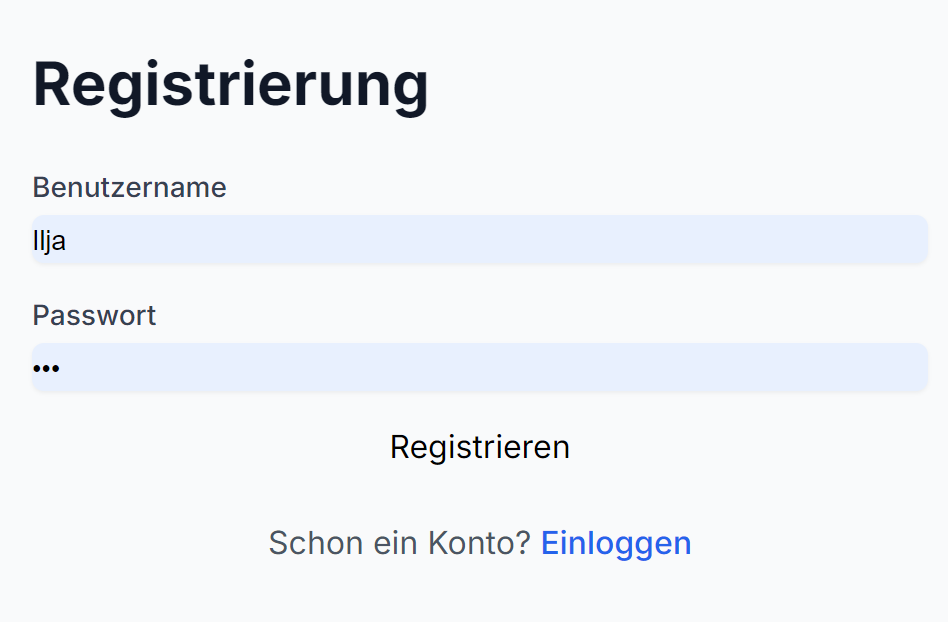
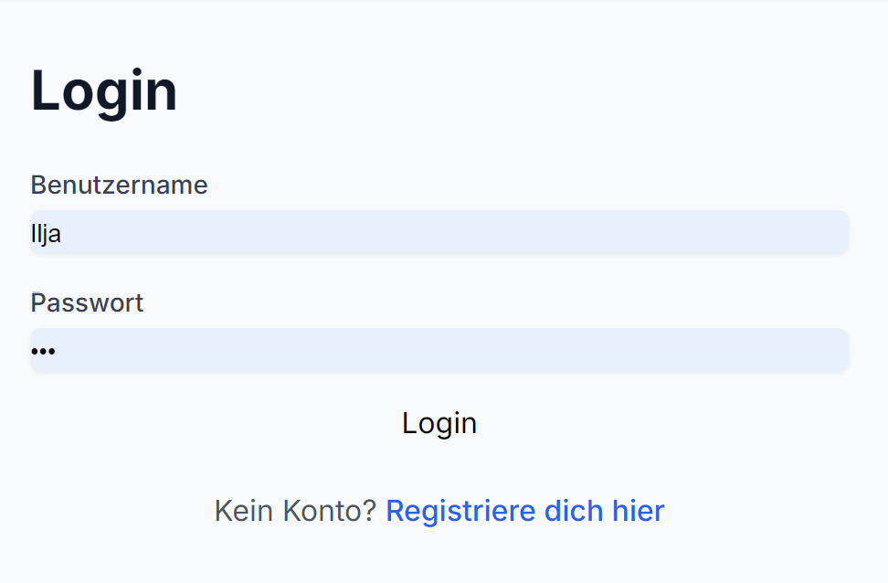
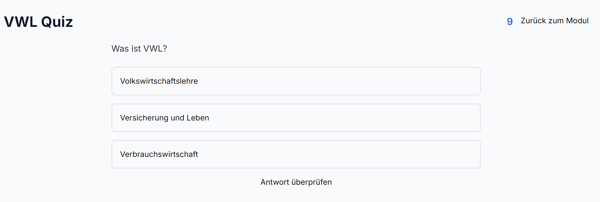
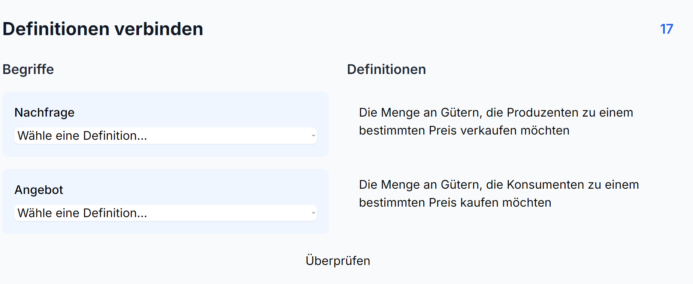
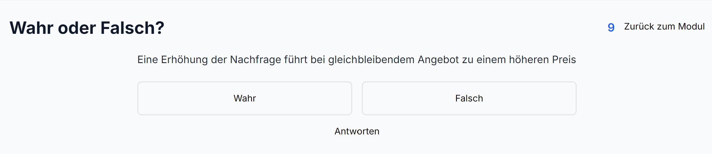

{: .label }
Mattihieu Weinlein


> ```
> ---
> title: UI Components
> nav_exclude: true
> ---
> ```

# UI components

Wir haben hier die wesentlichen bestandteile der Web-App nochmal visuell dargestellt.

## Regestrierung/ Einloggen

Die Regestrierungs und Login- Seite sind ziemlich simple gehalten, damit der Nutzer schnell und intuitiv durch den Anmeldeprozess kommen kann.



## Spiele
Wir haben drei verschiedene Spielarten 

Quiz:


Definition verbinden:


Wahr oder Falsch:
